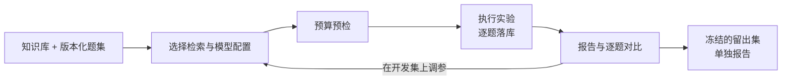

# RAG Quality Lab

[](https://github.com/asifours-blip/llm-evaluation-playground/actions/workflows/ci.yml)

改了一下切片大小，准确率从 70% 变成 72%，这到底是真的变好了，还是换了几道题碰巧答对了？这次实验又花了多少钱？

RAG Quality Lab 是一个本地运行的 RAG 评测工具，专门回答这类问题。它把检索、回答、拒答和成本拆开来记录，每道题的结果都能逐条对比，每次实验用的代码版本、数据、配置和定价都会冻结下来，事后可以复查。



## 它帮我发现了什么

用 DeepSeek 跑的一次 384 组完整实验里，模型对**本该拒答**的问题，约 61.5% 给出了实质性回答（[原始数据](docs/artifacts/live-384-2026-08-21/evidence-summary.json)）。平均分看不出这个问题，拆开来按题型统计才暴露出来。这正是这个工具想做到的：让问题有据可查，而不是被一个总分掩盖。

## 几个值得一说的设计

**钱花在哪里都要先算清楚。** 每一次外部调用都要先过预算预检，包括建索引、向量化查询、生成答案和 Judge 打分，预检通过才会发出请求。某个模型缺少单价就直接拒绝运行，不会按 0 元计算。开发中发现过建索引的调用绕过了预算，修复之后补了[回归测试](tests/experiments/test_embedding_budget_boundary.py)。

**中断了可以接着跑，不会重复花钱。** 每道题的执行状态和预算账本都会持久化。进程被杀掉后恢复运行，已完成的题不会重新请求，预算从已经花掉的金额接着算。请求已经发出、但结果不确定的调用，按上限计入费用，并且默认不自动重发。

**比较结果之前，先确认是公平比较。** 两组配置只有在语料、题集、随机种子都相同的情况下才允许成对比较；如果改动的参数超过一个，报告顶部会提醒"差异不能归因于单一改动"。题集分成开发集和留出集，留出集冻结后，任何改动都会被检测出来并拒绝使用。

**除了逐题，也能按"整个任务有没有做成"来打分。** 一个任务往往要经过好几步，单看每一步都对，最后仍可能没做成。`rag-quality task-eval` 用一份冻结的 12 个合成任务，按完整任务确定性评分；没交上来的任务也算失败，成功率始终以全部 12 个任务为分母，另外单列收到多少、完整多少。演示里 4/12 对 5/12 只是用来验证比较流程，不代表真实系统的水平。（[输入契约与边界](docs/task-evaluation.md)）

**给出两个本地检索基线。** 哈希向量和 BM25 都不依赖外部服务，结果完全可以复现，方便判断"换成真实向量模型之后，提升到底有多少"。

**附带一个轻量 Web 工作台。** 只用 Python 标准库实现，和命令行共用同一套逻辑，两边生成的报告逐字节一致。服务默认只允许离线运行，请求路径限制在工作目录之内，写操作只接受同源请求。

## 技术栈

Python 3.11 · Pydantic · SQLite · Jinja2 · OpenAI 兼容 HTTP 客户端 · pytest / Ruff / mypy · GitHub Actions

## 本地运行

```bash
python -m venv .venv && source .venv/bin/activate   # Windows：.venv\Scripts\Activate.ps1
pip install -e ".[dev]"
rag-quality run --config configs/offline.yaml        # 离线实验，不需要模型密钥
rag-quality serve --workspace .                      # 工作台：http://127.0.0.1:8765
```

真实模型实验、中断恢复、成对比较和人工盲标等完整用法见[运行参考](docs/reference.md)。

## 文档

- [系统架构](docs/architecture.md)：模块划分、实验身份、预算安全
- [运行参考](docs/reference.md)：全部命令、状态流转、检索基线、比较规则
- [完整任务评测](docs/task-evaluation.md)：任务套件、输入契约和合成演示的边界
- [数据集复核](docs/dataset-v1.1-review.md)：留出集怎么划分，每道题的复核意见
- [历史实验产物](docs/artifacts/)：原始结果、费用和标注记录

## 目前的边界

- 题集只有 48 道题，适合做回归和方法验证，不足以支撑大范围的统计结论。
- 留出集的 16 道题在划分之前被历史实验用过，因此只能保证之后的调参不碰它；题目复核是由 AI 完成的。
- Judge 的人工校准样本较少，而且偏向简单题，校准结论不宜推广到困难题。
- 这是一个单机工具，不支持多用户同时使用。

---

仓库最早是一个 LangChain 演示项目，后来重写为现在的 `rag_quality_lab`；仓库名 `llm-evaluation-playground` 为了保留旧链接没有改。
