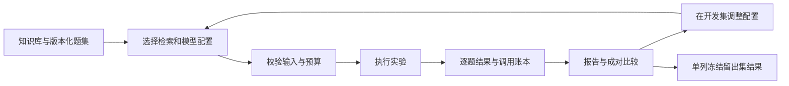

# RAG Quality Lab

[](https://github.com/asifours-blip/llm-evaluation-playground/actions/workflows/ci.yml)

调整 RAG 的切片、检索和提示词后，需要知道结果为什么变了、哪些问题仍答不好，以及一次实验花了多少。RAG Quality Lab 把这些信息保存在同一份实验记录里，让检索、回答、拒答和成本可以分别检查、逐题比较。

它提供命令行和本地 Web 工作台，适合围绕一份小型知识库建立基线、分析失败并保留可复查的报告。

## 使用流程



## 它能做什么

- **组织实验**：在 CLI 或本地工作台查看数据集与配置，启动离线实验，检查状态并生成报告。
- **比较检索**：选择哈希向量或 BM25 本地基线，查看命中证据、排名及不同配置的逐题差异。
- **分开衡量质量**：独立报告检索、答案、拒答和 Judge 指标，避免平均分遮住某类失败。
- **控制调用与恢复**：请求前预留预算，中断后继续未完成部分；已完成结果不重复请求，未知结果默认不重发。
- **管理证据**：保存配置、数据与提示词哈希、代码版本和逐次调用记录，冻结留出集并导出 JSON / HTML 报告。

## 工程取舍

| 问题 | 处理方式 | 可核查位置 |
| --- | --- | --- |
| 索引和指标计算也可能调用远程 embedding | 预算覆盖索引、查询、答案 embedding 与生成、Judge；按批次预留和结算，缺少单价时拒绝发送 | [执行器](src/rag_quality_lab/experiments/runner.py) · [预算说明](docs/architecture.md#预算安全) |
| 中断后重跑可能重复付费 | 持久化执行状态与账本；已发出但未结算的调用记为未知，恢复沿用已花费金额 | [存储实现](src/rag_quality_lab/experiments/store.py) · [恢复规则](docs/reference.md#中断恢复与取消) |
| 小语料不必引入向量数据库 | 内存检索保留确定性哈希与 BM25 两个本地基线，减少额外服务依赖 | [检索模块](src/rag_quality_lab/retrieval/) · [基线说明](docs/reference.md#检索基线) |
| 改题或混合调参会影响结论 | 冻结留出题内容；比较先校验语料、题集与种子，不同参数超过一个时提示无法单变量归因 | [冻结实现](src/rag_quality_lab/config/holdout.py) · [比较规则](docs/reference.md#成对比较与单变量约束) |
| Judge 分数需要解释依据 | 盲标导出隐藏模型及配置，校准后判断能否作为阻断指标；双顺序比较记录位置敏感结果 | [校准模块](src/rag_quality_lab/metrics/calibration.py) · [标注流程](docs/reference.md#judge-人工盲标) |
| 工作台操作会读写本地文件 | 路径限制在 workspace，写操作使用同源 JSON POST；报告复用 CLI 实现 | [Web 实现](src/rag_quality_lab/web/) · [工作台测试](tests/web/) |

## 技术栈

Python、Pydantic、SQLite、Jinja2；标准库 HTTP 工作台；OpenAI 兼容 HTTP 客户端。pytest、Ruff 与 mypy 提供离线质量检查。

## 快速开始

需要 Python 3.11+。在仓库根目录创建虚拟环境后运行；安装需要下载依赖，以下实验使用本地替身，不读取模型密钥。

```bash
python -m venv .venv
# Linux/macOS: source .venv/bin/activate
# Windows PowerShell: .venv/Scripts/Activate.ps1
python -m pip install -e ".[dev]"
rag-quality validate --config configs/offline.yaml
rag-quality run --config configs/offline.yaml
rag-quality serve --workspace .
```

工作台默认地址为 `http://127.0.0.1:8765`，默认不允许真实调用。CLI 输出实验 ID 与报告位置；完整命令、恢复、批量 embedding、定价与校准操作见[运行参考](docs/reference.md)，备份入口见[备份脚本](scripts/backup_restore.py)。

## 验证状态

截至代码提交 [`d87a35d`](https://github.com/asifours-blip/llm-evaluation-playground/commit/d87a35d18308d74fe5328fd7a7e0d2ce8bc3ca99)，[CI 36456756848](https://github.com/asifours-blip/llm-evaluation-playground/actions/runs/36456756848) 成功：检查源码与测试类型、离线测试、聚焦模块覆盖率及固定回归基线。它不执行真实模型实验。

历史模型产物与当前软件能力分别记录：

| 证据 | 能说明什么 | 不应外推的结论 |
| --- | --- | --- |
| [离线报告](docs/artifacts/offline-summary.json) | 执行、存储和报告可复查 | 替身答案分数不是模型质量 |
| [历史完整矩阵](docs/artifacts/live-384-2026-08-21/evidence-summary.json) | 2026-08-21 的逐题结果、HTTP 计数与费用 | 执行完成不代表回答质量达标 |
| [数据集版本复核](docs/dataset-v1.1-review.md) | 切分方法、冻结内容和复核来源 | 题目曾被历史实验使用，不是全新未见样本 |

实验编号、精确数值与校准限定保留在[详细参考](docs/reference.md#已验证状态)和原始产物中，不以历史成绩代替新增功能的效果验证。

## 文档

| 文档 | 内容 |
| --- | --- |
| [系统架构](docs/architecture.md) | 模块、实验身份、并发与预算 |
| [运行参考](docs/reference.md) | 完整命令、状态迁移、基线、留出集、比较与校准 |
| [数据集复核](docs/dataset-v1.1-review.md) | 切分复现、逐题意见与样本边界 |
| [设计规格](docs/design-spec.md) | 设计约束与原始方案 |
| [调用计数设计](docs/superpowers/specs/2026-08-21-http-attempt-observability-design.md) | 物理 HTTP 尝试计数与历史兼容 |
| [历史实验产物](docs/artifacts/) | 规范化结果、报告、费用与标注记录 |

## 局限

- 本地哈希与 BM25 是检索基线；离线答案由替身提供，不能据此宣称真实 RAG 效果优秀。
- 数据集规模有限，当前冻结的留出题曾进入历史实验；尚无该版本留出集的实验结果，复核由 AI 完成，见[数据集说明](docs/dataset-v1.1-review.md)。
- 历史 Judge 校准样本较少且部分偏容易，不能外推到困难样本；历史不理想结果仍保留在[原始摘要](docs/artifacts/live-384-2026-08-21/evidence-summary.json)。
- SQLite 与本地工作台面向单机使用，不提供多租户服务；真实调用前需重新核对定价、配置与预算。

## 仓库历史

项目由早期 LangChain 演示重写为 `rag_quality_lab`，仓库名 `llm-evaluation-playground` 保留旧链接。后续增加预算账本、实验恢复、基线比较与工作台；历史导入不代表线上迭代周期。
